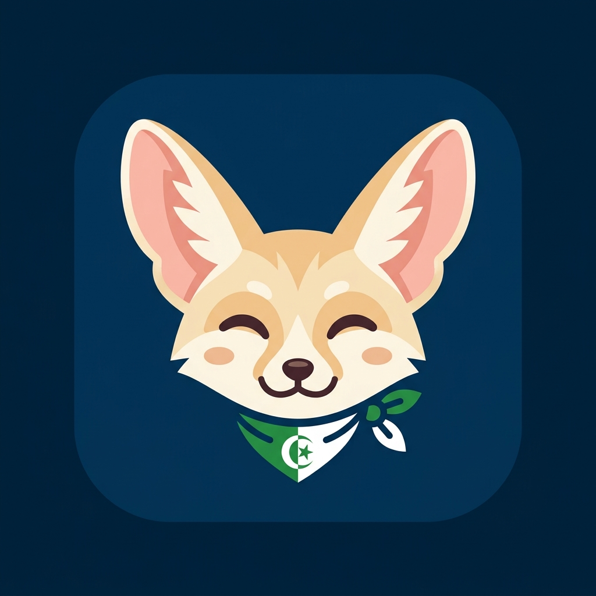
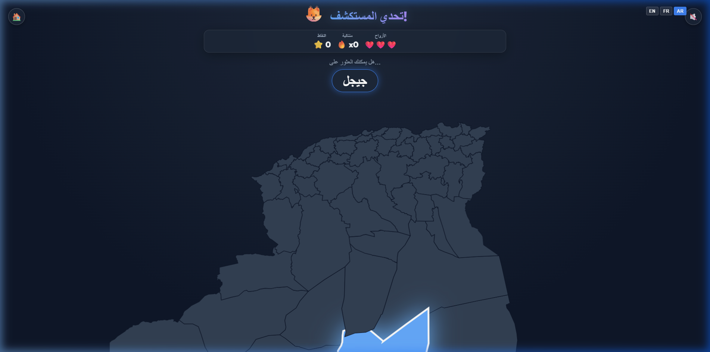

<div align="center">
  
  
  # 🇩🇿 Algeria Wilaya Explorer

  **An interactive, offline-capable educational game designed to make learning Algerian Geography fun for kids and adults alike!**

  [](https://dzmap.vercel.app/)
  [](https://dzmap.vercel.app/)
  []()
  []()
  [](https://opensource.org/licenses/MIT)
</div>

---

<p align="center">
  
</p>

## 🌟 Features

- **🎮 6 Interactive Game Modes:**
  - **Classic:** Find the highlighted wilaya on the map.
  - **Reverse:** The map highlights a wilaya, and you must pick its name from a list.
  - **Capitals:** Identify the wilaya based on its capital city name.
  - **Trivia:** Answer a fun geographical, historical, or cultural fact to find the wilaya!
  - **Region Explorer:** Group wilayas by geographical regions (North, South, East, West, Central, Highlands, Tell, Sahara).
  - **Study Guide:** Relax, click around the map, and learn detailed facts, capitals, and read Wikipedia summaries about each wilaya at your own pace.

- **🌐 Multi-Language Support:** Fully translated into **English**, **French**, and **Arabic** (including right-to-left layout alignment).
- **🌍 Global Leaderboard:** Compete with friends and family! Top scores are synchronized in real-time via Firebase Firestore.
- **📲 Progressive Web App (PWA):** Install it directly to your iOS or Android home screen. Fully playable **offline** without an internet connection!
- **🏅 Achievement Badges:** Unlock special badges for mastering different modes, answering trivia, and achieving high streaks.
- **🎵 Music & Audio:** Features subtle, relaxing background music, victory chimes, and the Algerian National Anthem!
- **🎨 Modern UI/UX:** Stunning glassmorphism design, colorful SVGs, fluid zoom, and satisfying victory animations.

## 🛠️ Tech Stack

- **Frontend:** [React.js](https://reactjs.org/), [Vite](https://vitejs.dev/)
- **Styling:** Vanilla CSS3 with Modern Glassmorphism & Animations
- **Map Rendering:** `react-simple-maps`, `d3-geo`, TopoJSON (Custom tailored Algerian SVG Maps)
- **Backend/Database:** Firebase Firestore (for Global Leaderboard)
- **PWA Capabilities:** `vite-plugin-pwa`, Workbox (offline caching and manifest generation)
- **Wikipedia Integration:** Fetches real-time educational facts from the official Wikipedia API.

## 🚀 Getting Started Locally

If you want to run this project on your own machine, contribute, or modify the maps:

1. **Clone the repository:**
   ```bash
   git clone https://github.com/tinouchemassinissa/Algeria-Map-Game.git
   cd Algeria-Map-Game
   ```

2. **Install dependencies:**
   ```bash
   npm install
   ```

3. **Set up Firebase (Optional for Leaderboard):**
   - Create a project on [Firebase Console](https://console.firebase.google.com/).
   - Add a Web App and copy the config.
   - Replace the configuration in `src/firebase.js`.

4. **Start the development server:**
   ```bash
   npm run dev
   ```

5. **Build for production:**
   ```bash
   npm run build
   ```

## 🤝 Contributing

Contributions, issues, and feature requests are welcome! Feel free to check the [issues page](https://github.com/tinouchemassinissa/Algeria-Map-Game/issues).

## 👨‍💻 Author

Created with passion by **Massinissa TINOUCHE**  
📍 San Jose, CA USA

---
*If you like this project and found it useful for learning, feel free to give it a ⭐ on GitHub!*
